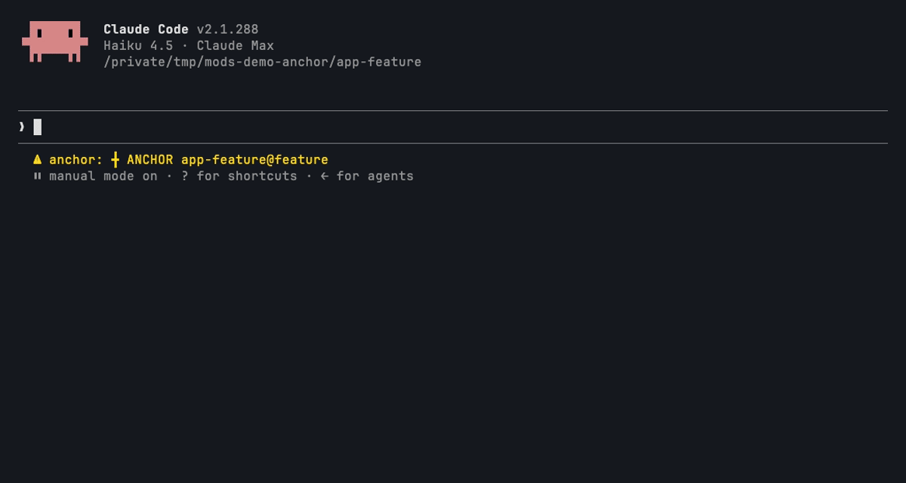

# anchor

```
   ▄▀▀▄      ▄▀▄ █▄ █ ▄▀▀ █ █ ▄▀▄ █▀▄
  ▄▄▀▀▄▄     █▀█ █ ▀█ █   █▀█ █ █ █▀▄
    ██       ▀ ▀ ▀  ▀  ▀▀ ▀ ▀  ▀  ▀ ▀
█▄  ██  ▄█
 ▀▀▀██▀▀▀    PIN THE SESSION TO ITS WORKTREE
```



**The problem:** the shell leaves the worktree. In the study behind this library, 27k of 78.6k Bash calls started with `cd`, and 1,859 "shell cwd was reset" notices showed commands landing in the wrong checkout.

anchor pins a Claude Code session to the directory it started in. Every Bash call, including the calls of subagents that share the session's directory, runs from the anchor. When the anchor is a linked git worktree, the primary checkout is guarded: edits and git writes that would land there are denied.

## Install

```
/plugin marketplace add pourya7/claude-code-mods
/plugin install anchor@claude-code-mods
```

## What it does

- **Anchor.** On session start, anchors to the session's cwd. If that is a linked git worktree, it also records the primary checkout (the parent of `git rev-parse --git-common-dir`). Git prints paths with symlinks resolved, so anchor spells them back the way the session's cwd spells them (for example `/tmp/...` rather than `/private/tmp/...` on macOS), and guards both spellings.
- **Kept across reloads.** Session start fires again when the plugin is enabled, its worker respawns or its module reloads. The anchor the session already has is kept: `/anchor off` stays off and `/anchor <path>` stays moved.
- **Bash rewrite.** Every Bash command becomes `cd '<anchor>' && { <command>` plus a newline and `}`, unless it already starts with `cd '<anchor>' && `, so the rewrite happens once. The `{ }` group makes the `cd` cover the whole command: without it, `cd X && a & b` would run `b` outside X, because `&` sends the whole `&&` chain to the background. The newline before `}` keeps a trailing comment or heredoc from swallowing it. Single quotes in the path are escaped (`'\''`).
- **Subagents.** A subagent that shares the session's directory is rewritten and guarded like the session. A subagent spawned with its own `cwd` is anchored to that directory instead, with its own guard. A subagent spawned with `isolation: "worktree"` (or `"remote"`), and any subagent it spawns, passes through untouched, so its commits stay in its own worktree.
- **Primary-checkout guard.** Only when the anchor is a linked worktree and `protectPrimary` is on:
  - `Edit`, `Write` and `NotebookEdit` targets inside the primary checkout but outside the anchored worktree are denied. A worktree nested under the primary checkout (for example `.worktrees/x`) is never denied.
  - Bash commands that run `git commit`, `checkout`, `switch`, `reset`, `stash`, `merge`, `rebase`, `push`, `branch -D` or `restore` against the primary checkout, through `cd <primary>` or `pushd <primary>` (relative `cd ../..` and `cd -P` included) or `git -C <primary>`, are denied. Leading `NAME=value` assignments and the `command`, `env`, `exec`, `nohup` and `time` wrappers are read through, as is `/usr/bin/git`. A `cd` before a lone `&` does not carry past it, matching the shell.
  - The deny names the anchor and says how to lift the guard (`/anchor off`). A toast shows each deny.
- **Status line.** `╋ ANCHOR <worktree>@<branch>`, cut to 40 columns. It clears while the anchor is off.

The rewrite makes each command compound (`cd … && cmd`). Claude Code checks permissions on each part, so a narrow allow rule such as `Bash(pwd)` still has to match the command after the `cd`.

## Commands

| Command | Does |
|---|---|
| `/anchor` | Shows the anchor, the primary checkout and whether it is guarded |
| `/anchor <path>` | Re-anchors to `<path>`, which may be relative to the current anchor. The path must be an existing directory. |
| `/anchor off` | Disables anchor: no rewrite, no guard, no status line |
| `/anchor on` | Restores the last anchor after `/anchor off` |

## Options (`userConfig`)

| Option | Type | Default | Meaning |
|---|---|---|---|
| `protectPrimary` | boolean | `true` | When anchored in a linked worktree, deny edits and git writes that land in the primary checkout. The Bash rewrite runs either way. |

Set it in `/config`, or in settings under `pluginConfigs.anchor.options.protectPrimary`.

## The UI

`/anchor` reply. The sprite is drawn with half blocks in PICO-8 blue `#29ADFF`, with a white ring and a navy shadow. It turns grey while the anchor is off.

```
   ▄▀▀▄     ╋ ANCHOR SET  fix-login@fix/login
  ▄▄▀▀▄▄    ANCHOR  /work/repo/.worktrees/fix-login
    ██      PRIMARY /work/repo  GUARDED
█▄  ██  ▄█  BASH    cd '/work/repo/.worktrees/fix-login' && ...
 ▀▀▀██▀▀▀   OFF     /anchor off
```

Status line:

```
╋ ANCHOR fix-login@fix/login
```

Toast on a deny:

```
╋ ANCHOR BLOCKED GIT COMMIT IN PRIMARY
╋ ANCHOR BLOCKED EDIT IN PRIMARY
```

Where nothing draws (`claude -p`, VS Code), `/anchor` replies with the same lines as plain text.

## Permissions

| Network | Runs processes | Files | Calls a model | Auto-submits prompts | Data leaving the machine |
|---|---|---|---|---|---|
| None | Yes: `git rev-parse --path-format=absolute --git-dir --git-common-dir --show-toplevel`, `pwd -P` and `git branch --show-current`, all read-only and run in the anchor directory. They run at session start (only when the session has no anchor yet), on `/anchor <path>`, and when a subagent is spawned with its own `cwd`. | Reads nothing. Stats the `/anchor <path>` target to check that it is a directory. Writes nothing. | No | No | None. Rewritten commands and deny reasons go only to your own Claude Code session. |

anchor changes tool calls: it rewrites Bash commands and denies some `Edit`, `Write`, `NotebookEdit` and Bash calls. It never approves a permission prompt.

## Limits

- Paths are compared as written, after `.` and `..` are resolved, in two spellings: the session's and git's (symlinks resolved). Another symlink into the primary checkout, made inside the worktree for example, is not followed.
- The git-write check reads `cd`, `pushd` and `git -C` in plain command chains. It does not read `cd ~`, `cd -`, `popd`, `env -C`, variables, `eval`, `bash -c` or other nested scripts. A `cd` inside `( … )` is treated as if it carried past the `)`, which can deny more than the shell would.
- Subagents are told apart by the spawn anchor sees. A worktree-isolated subagent is not guarded at all, since anchor does not know where its worktree is. A subagent spawned before anchor loaded is treated as sharing the session's directory.
- With a bare repository and its worktrees, there is no primary checkout to guard, so only the rewrite applies.

## Develop

```
claude plugin validate anchor
claude plugin test anchor
```
