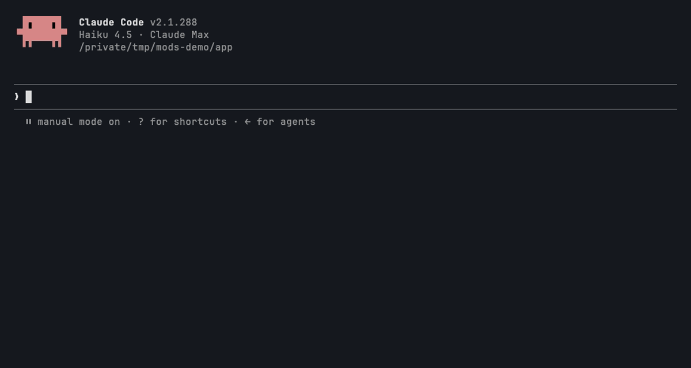

```
█ █ █▀█ █▄ █ █▀▀ █▀ ▀█▀   █▀▀ ▀▄▀ █ ▀█▀
█▀█ █▄█ █ ▀█ ██▄ ▄█  █    ██▄ █ █ █  █    EXIT ▸ 3 CAUGHT
```

# honest-exit — loud shell failures



**The problem:** the shell fails quietly, and the model reads the quiet as success. A zsh glob that matches nothing makes zsh refuse to run the command that holds it. A command that works in your terminal is missing from the agent's shell, because your alias isn't loaded there. A test run piped into `tail` exits 0 even though the tests failed, because the pipeline's status is `tail`'s. The study behind this library counted **186 zsh "no matches found" errors** (each one a command that never ran), exit codes hidden by pipes, and `exit=$?` echoed by hand **~1,000 times** to work around it.

honest-exit reads every Bash result, in the main loop and in subagents. When it spots one of these quiet failures, it attaches a note that only the model reads, explaining what really happened, and shows you a toast. It never blocks a command.

## Install

```
/plugin marketplace add pourya7/claude-code-mods
/plugin install honest-exit@claude-code-mods
```

## What it catches

| Catch | How it is spotted | What the model is told |
|---|---|---|
| **GLOB** | The shell's own error text has zsh's `no matches found: <pattern>`, bash's failglob `no match: <pattern>`, or csh's `No match.` | The glob didn't match, so the command that contained it never ran. Other commands on the same line (joined by `;`, `\|\|` or newlines) may still have run, so read their output before re-running anything. Check the path, or quote the pattern if a tool such as `grep` or `find` should expand it. |
| **NOT FOUND** | The output has the shell's own `command not found` line (zsh, bash or sh) for a name people commonly alias: `cp`, `rm`, `mv`, `grep`, `ls`, `ll`, `la`, `l`, `cat`, `python`, `pip`. Other missing names are left alone. | It is often an alias or function in your interactive shell, and agent shells may differ. The command that used the name did not run, but other commands on the same line may have, so read their output before re-running anything. Locate the real binary instead of assuming the alias. |
| **PIPE** | The call exited 0, the output contains a failure word (`FAILED`, `failed`, `Error:` and `TypeError:`-style names, `✗` or `✖`, `N failing`, `Traceback`, and Node's test runner summary `ℹ fail N` / `failing tests:`), **and** the command pipes into `head`, `tail`, `tee` or `grep`, or ends in `\|\| true`. Every word counts when a test, lint or build command (`pytest`, `npm test`, `node --test`, `cargo build`, `make`, and the like) runs before the pipe; for those, the `operator: '…'` line that ends a Node assertion dump counts too. For any other program only `FAILED`, `N failing`, `ℹ fail N`, `failing tests:` and `Traceback` count, and not when the command spells the word itself (a search term). Commands that only print existing text (`cat`, `grep`, `rg`, `git`, `sed`, `jq` and the like) never count: a failure word in a log or a commit message is data. `0 failed`, `0 failing` and `ℹ fail 0` don't count. A pipe behind `set -o pipefail` doesn't count either, but `\|\| true` still does. | The pipeline hid the exit status of the first command. Treat the run as failed until it is re-run without the pipe, or with `set -o pipefail;` and `tail` (not `head`, which can turn a pass into status 141). |

GLOB and NOT FOUND read only the shell's own error text: everything the call printed when it failed, and only stderr when it succeeded (zsh carries on to the next command after a failed one, so the line can still show up then). A `no matches found` line in a file you `cat` or a search you run is never mistaken for the shell.

The note is attached as the call's `context`: the model reads it right after the tool result, and you never see it in the transcript. Denied calls, interrupted calls and commands still running in the background are skipped. honest-exit doesn't watch any tool other than Bash.

## Optional rewrites

Rewrites are off by default. With `rewrite` on, honest-exit fixes two shapes before the command runs, and tells the model exactly what changed:

- **Quote flag globs.** `grep -r --include=*.ts foo .` becomes `grep -r --include='*.ts' foo .`, so the shell can't expand the glob (or refuse to run when nothing matches). Values that are already quoted, or contain `$` or a backtick, are left alone. So is anything inside a quoted string. So are brace lists such as `--include=*.{ts,tsx}`: the shell expands those into one flag per pattern, and `grep` itself doesn't know braces, so quoting them would make the search match nothing.
- **Add pipefail.** `set -o pipefail; ` goes in front of a command that pipes a test, lint or build command (`pytest`, `jest`, `vitest`, `npm test`, `cargo build`, `tsc`, `eslint`, `make`, and the like) into `tail`. Never `head`: `head` stops reading early, the command before it is killed by SIGPIPE, and with pipefail a passing run would report status 141. A command that already sets pipefail is left alone.

Both rewrites are idempotent. A command that has already been rewritten runs as it is, and the model gets no second note.

## Commands

| Command | What it does |
|---|---|
| `/honest-exit` | Opens the HONEST EXIT pane. The text reply lists the count and each recent catch: time, kind, command and clue. Subagent catches are marked `SUBAGENT`. |
| `/honest-exit clear` | Resets the count and the list, and clears the status line. |

## Configuration (`userConfig`)

| Field | Type | Default | Meaning |
|---|---|---|---|
| `rewrite` | boolean | `false` | Before a Bash call runs, quote unquoted globs in `--flag=*.x` arguments and add `set -o pipefail;` when a test, lint or build command is piped into `tail`. |

You can change it in the `/config` menu, or under `pluginConfigs.honest-exit` in your settings.

## The UI

A toast for each catch:

```
HONEST EXIT ▸ GLOB MATCHED NOTHING: src/**/*.tsx
HONEST EXIT ▸ NOT IN THIS SHELL: ll
HONEST EXIT ▸ PIPE HID A FAILURE: 2 failing
```

The status line shows a counter once something has been caught (`EXIT ▸ 3 CAUGHT`). It stays empty until the first catch.

The `/honest-exit` pane:

```
 █████▄   █     ▶ HONEST EXIT
 ██████  ▄▄     3 CAUGHT THIS SESSION
 ██████▄████▄   REWRITES OFF
 ██████ ▄▀▀▄    ■ GLOB ■ NOT FOUND ■ PIPE
▄███████▄▄▄▄█▄
────────────────────────────────────────────────────────────
PIPE      12:41 npm test 2>&1 | tail -5  ▸ 2 failing
NOT FOUND 12:38 SUB ll src  ▸ ll
GLOB      12:30 wc -l src/**/*.tsx  ▸ src/**/*.tsx

[ CLEAR ]
```

This capture is plain text. In the terminal, the sprite is a green EXIT light over a dark doorway. A peach runner is caught on the way out, under a red alarm. The kinds are coloured too: GLOB orange, NOT FOUND yellow, PIPE red. All the colours come from the PICO-8 palette. VS Code and `claude -p` draw no pane, so the toasts, the status line and the `/honest-exit` text reply are what you see there.

## Permissions

| Network | Runs processes | Files | Calls a model | Auto-submits prompts | Changes your commands | Data leaving the machine |
|---|---|---|---|---|---|---|
| None. No `$.http`. | None. No `$.process`. It only reads the result of the Bash calls the model already made. | None. No `$.fs`. The count and the last 20 catches live in `$.state` for the session. Nothing goes to `$.store`. | No. There is no `$.model` call: detection is deterministic text matching. | No. There is no `$.prompt.submit`. | Only with `rewrite` on: it quotes `--flag=` globs and adds `set -o pipefail;`, and every rewrite is reported to the model. Off by default. | Nothing of its own. The notes become part of the tool result your own model already receives. |

These are the engine calls it makes: `$.clock.now`, `$.command.register`, `$.state.get`/`set`, `$.ui.open`, `$.ui.resolve`, `$.ui.status` and `$.ui.toast`.

## Limits

- **No exit code.** The mods API reports whether a Bash call errored (`isError`), not its exit code. "Exited 0" means the tool did not report an error.
- **English shell messages.** Detection matches the shells' own English error lines. A shell with a translated locale won't be caught.
- **Heuristics.** The alias list and the list of test, lint and build commands are fixed. A script that runs your tests under another name gets only the strong words (`FAILED`, `N failing`, `ℹ fail N`, `failing tests:`, `Traceback`), and a check command that prints `Error:` while passing still gets a note. A false hit adds only a note, never a block.
- **stderr.** On a call that succeeded, GLOB and NOT FOUND read only stderr. A command that sends stderr to stdout (`2>&1`) and still exits 0 hides the shell's line from them.
- **Truncated output.** Detection reads the output the tool returned. If the output was too large and saved to a file, a signature beyond the inline part is missed.
- **Rewrites are bash/zsh.** `set -o pipefail` works in bash and zsh, which are the shells Claude Code runs commands in. It doesn't work in plain `sh`.
- **Toasts are plain text.** Peach is used in the pane and the sprite. Toasts and the status line are drawn in the surface's own colours.

## Development

```
claude plugin validate honest-exit
claude plugin test honest-exit
```

The pure logic lives in a few files:

- `hooks/detect.ts`: the three detectors, the notes and the outcome reader.
- `hooks/rewrite.ts`: the two idempotent rewrites.
- `hooks/shell.ts`: quote masking and pipe reading.
- `hooks/sprite.ts`: the palette and the half-block renderer.

`hooks/register.tsx` connects them to the engine. The tests cover each detector with positive and negative cases, show that rewriting is off by default, check that a rewrite is idempotent, and mount the pane on both `terminal` and `desktop`.
