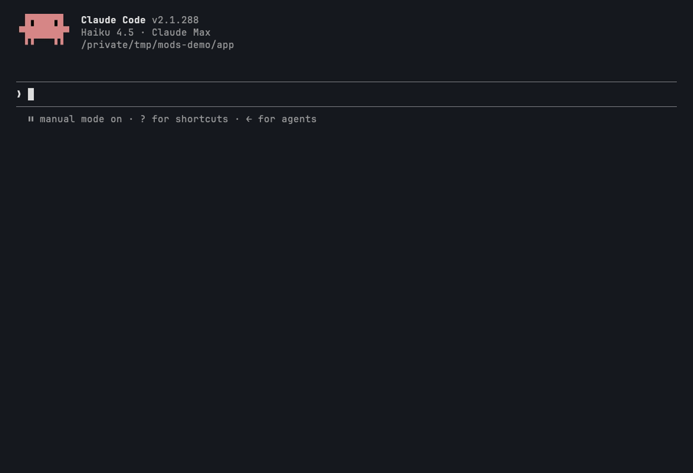

```
█▀▄▀█ █▀▀ █▄ █ █▀▄ █▀▀ █▀█
█ ▀ █ ██▄ █ ▀█ █▄▀ ██▄ █▀▄   PATCH LOG
```



# mender — fix the arguments, not the model

**The problem:** MCP tool calls fail on the shape of their arguments, not on what they mean. The model sends `"true"` where the tool wants `true`, `"10"` where it wants `10`, one label where it wants a list, or a key the tool does not take. The tool refuses, the model guesses, and the turn burns a retry or two. The study behind this library counted **~65 schema errors** of exactly this kind: unknown keys, `"true"` for `true`, and numbers sent as strings.

mender sits on every MCP tool call (`mcp__*`), in the main loop and in subagents. When it knows the tool's input schema, it repairs the known-safe mistakes before the call goes out, then tells the model what it fixed so the model learns the right shape. It also notices when a server is down, and tells the model to stop retrying it.

## Install

```
/plugin marketplace add pourya7/claude-code-mods
/plugin install mender@claude-code-mods
```

## How it behaves

- **Repairs, only against a schema.** For a tool whose input schema mender knows, it changes a value only when the value does not already fit the schema:
  - `"true"` / `"false"` become booleans where the schema wants a boolean.
  - Numeric strings (`"10"`, `"0.5"`) become numbers where the schema wants a number. They become integers only where the schema wants an integer and the number is whole. A number that a JavaScript number cannot hold digit for digit (a 19-digit ID, anything past 2^53 - 1, a fraction of more than 15 significant digits) stays the string the model sent.
  - A single value becomes `[value]` where the schema wants an array, when the value fits the array's items. A JSON array string (`"[1, 2]"`) becomes the array.
  - A JSON object string (`"{\"pinned\": true}"`) becomes the object where the schema wants an object.
  - Unknown keys are dropped only when the schema says `additionalProperties: false` (and has no `patternProperties`), or when the server itself rejected that key before.
  - Nested objects and array items are repaired the same way, with their path (`meta.pinned`, `ids[0]`).
- **Never invents.** A missing required key stays missing. A value that already fits stays as it is, even `"true"` in a string field. A union that allows strings leaves strings alone. A coercion that would leave an `enum` is not made. Valid input passes through untouched, with no note.
- **Tells the model.** Each repaired call gets a model-only `context` note, for example:

  ```
  MENDER repaired the arguments of mcp__notes__create before it ran, against the tool's input schema:
  - draft: "true" → true (boolean)
  - colour: dropped (the schema allows no such key)
  Next time send them in this shape.
  ```

- **Learns from errors.** When an MCP call still fails with a schema or validation message, mender records `{tool, error}` for the `/mender` pane. When the message says which shape was wanted, mender learns it. It reads the error formats of the TypeScript MCP SDK (Zod issue lists), the Python MCP SDK (Pydantic errors), Ajv (`data/limit must be number`) and Joi (`"limit" must be a number`). It then attaches a note with the same call in the right shape, and repairs later calls to that tool. Learned shapes are kept across sessions in `$.store`. `/mender forget` clears them, and `learn: false` turns learning off.
- **Notices a server that is down.** When an MCP call fails because the server is not connected, refused or dropped the connection, or answered `HTTP 401` / `401 Unauthorized` / needs authentication, mender toasts `MENDER ▸ <SERVER> DOWN` once and attaches a note telling the model to stop retrying and ask you to reconnect it with `/mcp`. The first successful call to that server clears it, and a later outage toasts again. An ordinary error that only mentions `401` or "unauthorized" (an issue number, a per-item permission) is not an outage. A deny from a hook or permission rule counts only when it reads as a broken connection, never for auth wording.

### Where the schemas come from

The mods API in Claude Code 2.1.288 does not give a hook the input schema of an MCP tool: `$.tool.list()` returns names and descriptions only, and the `tool.call` envelope carries only the arguments. So mender gets its schemas from two places:

1. **A schema file** (`userConfig.schemaFile`, default `~/.claude/mender/schemas.json`). A missing file is fine. It holds either a map of full tool names to input schemas, or a server's `tools/list` answer under `servers`:

   ```json
   {
     "mcp__notes__create": {
       "type": "object",
       "properties": { "title": { "type": "string" }, "draft": { "type": "boolean" } },
       "required": ["title"],
       "additionalProperties": false
     },
     "servers": {
       "wiki": { "tools": [{ "name": "search", "inputSchema": { "type": "object", "properties": { "limit": { "type": "number" } } } }] }
     }
   }
   ```

2. **Shapes learned from the tool's own validation errors** (see above). A learned shape is partial. It knows only what the errors said, so it never drops a key the server has not rejected.

When a tool has both, mender uses the schema file with the learned shape laid over it: a type the server asked for replaces one the file does not allow, and keys the server rejected are dropped. Everything else in the file stays.

## Commands

| Command | What it does |
|---|---|
| `/mender` | Opens the PATCH LOG pane and prints the same as text. |
| `/mender list` | Prints the repairs and the recurring schema errors per tool. |
| `/mender reload` | Reads the schema file again. |
| `/mender forget [tool]` | Forgets the shapes learned from errors, for all tools or one (`mcp__wiki__search` or `wiki/search`). |
| `/mender off` / `/mender on` | Stops or resumes mender for this session. Off is a pure pass-through: no repairs, no learning, no notes, no toasts and no error log. |

## Configuration (`userConfig`)

| Field | Type | Default | Meaning |
|---|---|---|---|
| `schemaFile` | string | `~/.claude/mender/schemas.json` | The JSON file of MCP tool input schemas. `~` is your home directory. A missing file is fine; a bad one is reported once and skipped. |
| `learn` | boolean | `true` | Learn shapes from validation errors and repair later calls to match. Learned shapes are kept across sessions. |

You can change these in the `/config` menu, or under `pluginConfigs.mender` in your settings.

## The UI

The `/mender` pane, after a few calls. One call was repaired, one tool kept rejecting its arguments, and one server is down:

```
  ▀▀▀▀▀▀       MENDER  PATCH LOG
  ██████      1 CALL FIXED
  ██▀█▀█      2 FROM FILE · 1 LEARNED
  █▀▀▀▀█▄     ◆ WIKI DOWN · NOT CONNECTED
  ████████▄
   ▀▀▀▀▀▀▀▀▀
────────────────────────────────────────────────────────────
REPAIRS
12:00 notes/create  draft: "true" → true (boolean)
12:00 notes/create  colour: dropped (the schema allows no such key)
RECURRING ERRORS
 x1 docs/search  MCP error -32602: Input validation error: Invalid arguments for…
[ CLEAR LOG ] [ FORGET LEARNED ] [ TURN OFF ]
```

With nothing to report, the lists read `NOTHING TO MEND YET.` and `NONE. CLEAN RUN.`

This capture is plain text. In the terminal, the sprite is an orange sock with a white and grey cuff and a brown patch stitched in yellow. When a server is down, the sock turns grey. The title is white on brown, repairs are orange, dropped keys are brown and down servers are red. All the colours are from the PICO-8 palette.

The status line under the prompt stays quiet until something happens, then shows counts in under 40 columns, for example `MENDER ▸ 3 FIXED · 1 ERR · 1 DOWN`. VS Code and `claude -p` have no pane, so the status line, the toast and `/mender list` are what you see there.

## Permissions

| Network | Runs processes | Files | Calls a model | Auto-submits prompts | Changes tool calls | Data leaving the machine |
|---|---|---|---|---|---|---|
| None. No `$.http`. | None. No `$.process`. | Reads one file, the schema file (`$.fs.exists`, `$.fs.read`), and reads `HOME` to expand `~`. Writes no files. Learned shapes go to `$.store`; the repair log is kept only for the session, in `$.state`. | No. mender makes no `$.model` call. Repairs and error reading are deterministic. | No. | **Yes.** A `tool.call` hook rewrites the arguments of `mcp__*` calls before they run (only the repairs listed above), and adds model-only `context` notes to the result. Built-in tools are never touched. | Nothing new. The repaired arguments go to the same MCP server the model was already calling, and the notes go to your own model. |

## Limits

- **No schema, no repair.** Until a tool has an entry in the schema file or has returned a readable validation error, mender passes its calls through unchanged. The first malformed call to an unknown tool still fails once; the next one is repaired.
- **The JSON Schema subset.** mender reads `type` (including type lists), `properties`, `additionalProperties`, `patternProperties`, `items`, `anyOf`, `oneOf`, `enum` and `required`. It does not follow `$ref`, and it does not repair tuple `items` lists.
- **Error formats.** Learning reads the common validator formats listed above. Other error texts are still recorded as schema errors when they look like one, but teach nothing.
- **Down detection reads error text.** A server that fails with an unusual message is not flagged as down, and the patterns are kept narrow on purpose, so a bare `401` or "unauthorized" is never enough.

## Development

```
claude plugin validate mender
claude plugin test mender
```

Pure logic lives in `hooks/schema.ts` (the repairer and the schema file reader), `hooks/learn.ts` (error classification, learning, down detection), `hooks/text.ts` (notes and status) and `hooks/pixels.ts` (the half-block sprite renderer). `hooks/register.tsx` connects them to the engine. The tests drive MCP calls through the engine's `$.tool.call` with a fake server underneath, and mount the pane on both `terminal` and `desktop`.
