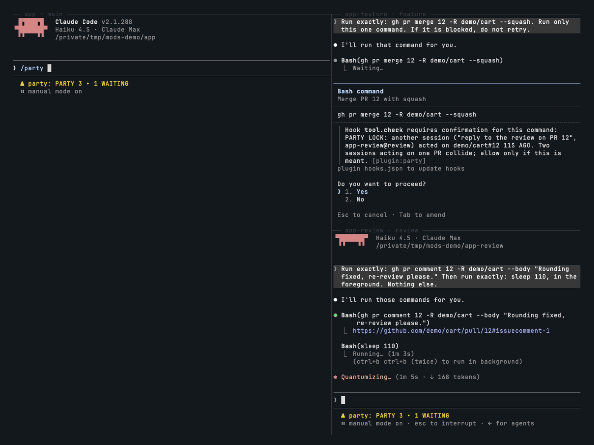

# party

```
▄▀▀▄ ▄▀▀▄ ▄▀▀▄   █▀█ ▄▀█ █▀█ ▀█▀ █▄█
▄▀▀▄ ▄▀▀▄ ▄▀▀▄   █▀▀ █▀█ █▀▄  █   █

                 THE RAID FRAME FOR YOUR SESSIONS
```



When you run several Claude Code sessions at once, each one sits in its own terminal tab. You only find out that one has been waiting on a permission prompt for twenty minutes when you happen to look at it, and nothing stops two sessions from merging, commenting on or editing the same PR a minute apart.

party gives every session on the machine one shared view: who is working, who is waiting on you and for how long, and a lock that makes the second session ask before it acts on a PR the first one just touched.

**The problem, in one line:** up to 5–10 sessions ran at once, they spent about 190 hours in total waiting on a human answer, and two sessions acted on the same PR.

## Install

```
/plugin marketplace add pourya7/claude-code-mods
/plugin install party@claude-code-mods
```

Install it in every session you want in the party. A session only shows up once party is loaded in it.

## How it works

- **Heartbeat.** Every session writes one entry to party's plugin store, under its own key. It writes on start, every 15 seconds, at each turn start and end, when it starts or stops waiting on you, and after a PR action. The entry holds the session id, a title, the working directory, the branch, the state, when that state began, the last tool it called, and its recent PR actions. An entry that has not been written for 2 minutes is stale: it is dropped from every view and deleted from the store.
- **States.**

  | State | When |
  |---|---|
  | `working` | A turn is running. |
  | `waiting-on-you` | A permission prompt, an `AskUserQuestion` question or an `ExitPlanMode` plan is open and waiting for your answer. Each wait belongs to the tool call that raised it and ends only when that call returns, so a parallel call or a subagent's call that finishes first does not end it. When the last wait ends, the session goes back to `working` if a turn is running and to `idle` if not. |
  | `idle` | The last turn ended and nothing is running. |
  | `done` | The session ended. It stays in the view until it goes stale. |

- **Nag.** When another session has waited on you for longer than `nagMinutes`, its bar turns red and you get one toast, for example `PARTY ▸ ship the release WAITING ON YOU 5M`. It toasts once per wait.
- **PR locks.** party records each `gh pr merge`, `close`, `comment`, `review` or `edit` that names a PR by number (`42`, `#42`, with `-R owner/repo` if given) or by URL (`https://github.com/owner/repo/pull/42`). A bare number is read against the session's `origin` remote. If another live session ran one of those on the same PR within `lockMinutes`, the call becomes a permission prompt that names that session:

  ```
  PARTY LOCK: another session ("ship the release", app-two@feat/release) acted on
  example/app#42 3M AGO. Two sessions acting on one PR collide; allow only if this is meant.
  ```

  The same session never locks itself out, and a deny from your settings stays a deny.

## Commands

| Command | What it does |
|---|---|
| `/party` | Opens the raid-frame pane and replies with the roster as text, which is what you see in `claude -p` and VS Code. |
| `/broadcast <text>` | Sends the text to every other live session through `$.session.send`. It skips this session and any session that is done. If a session cannot be reached, the reply names it and the text is copied to your clipboard so you can paste it there yourself. |

## Options

Set them in `/config` or under `pluginConfigs.party.options` in settings.

| Option | Default | Meaning |
|---|---|---|
| `nagMinutes` | `5` | How long another session may wait on you before its bar turns red and party toasts once. |
| `lockMinutes` | `10` | How long a PR action in one session makes the same action in another session ask first. |

## What it looks like

In the terminal the sprites are drawn in PICO-8 colours, with pink as party's colour. Each session's class icon matches its state: a blue knight with a raised sword while it works, a pink mage with a red `!` while it waits on you, a grey sleeper with a lavender `z` while it is idle, and a gold star once it is done. This text capture loses the colours.

The `/party` pane:

```
▄▀▀▄ ▄▀▀▄ ▄▀▀▄  P A R T Y
▄▀▀▄ ▄▀▀▄ ▄▀▀▄  3 IN PARTY · 1 WAITING ON YOU

▄▀▀▄▀ 2P ship the release
 ▀▀▄▄ ██████████ WAITING ON YOU · PERMISSION 6M
      app-two@feat/release · LAST Bash

▄▀▀▄▀ 3P refactor the cache
 ▀▀▀  ░░░░░░░░░░ WORKING 2M
      app-three@feat/cache · LAST Edit

▄▀▀▄▀ 1UP fix the login page
 ▀▀▄▀ ░░░░░░░░░░ IDLE 40S
      app@feat/login · LAST Bash
```

Waiting sessions are listed first, longest wait first. The bar is HP-style: it fills over `nagMinutes`, lime and then yellow, and is full and red once the wait passes `nagMinutes`. Rows for sessions that are not waiting show an empty grey bar and the time spent in their state. `1UP` is the session you are looking from.

The status line under the prompt stays under 40 columns:

```
PARTY 3 ▸ 1 WAITING
```

## Permissions

| Network | Runs processes | Files | Calls a model | Auto-submits prompts | Data leaving the machine |
|---|---|---|---|---|---|
| None. No `$.http`. | `git -C <cwd> rev-parse --abbrev-ref HEAD` (to read the branch) at session start and after each turn. Nothing else. | No `$.fs`. It writes one entry per session to its own plugin store (`$.store`, a JSON file under your Claude Code config directory). The entry holds the session id, the first line of the first prompt (40 characters at most), the working directory, the branch, the repository (`owner/name` from `origin`, or its root path), the state, the last tool's name, and recent PR numbers. Every session on the machine reads every entry, and deletes stale ones. | No. | No. `/broadcast` sends your text only when you run it, and only to your other sessions. | None. `/broadcast` delivers to your own sessions through Claude Code's `$.session.send`, and copies to your clipboard if a session cannot be reached. |

## Limits

- **One machine, one store.** party assumes every session reads the plugin store fresh, so one session sees what another wrote. The test kit runs one session at a time and cannot show this. If two sessions write at the same moment and one overwrites the other's entry, the next heartbeat (15 seconds later) puts it back. Sessions on other machines, in the cloud or without party loaded never appear.
- **Waiting is partly detectable.** The mods API has no "a dialog is open" event, so party infers it:
  - A permission prompt is a `tool.check` verdict of `ask` for a call this session is running. There is no event for the moment you answer a dialog, so the wait lasts until that call returns, **including the time the tool then runs**. If you approve a command that runs for ten minutes, the session shows `WAITING ON YOU · PERMISSION` for those ten minutes, its bar turns red and the other sessions get a nag. In a mode that decides asks for you (auto mode's classifier, a headless host), the same applies: an asked call shows as waiting until it returns.
  - `AskUserQuestion` and `ExitPlanMode` count as waiting by name until they return.
  - A turn that ends with a question in plain text shows as `idle`, not `waiting-on-you`. Other prompts (an MCP server asking for input, a login) are not detected.
- **Titles.** The mods API does not expose the session's own title, so party uses the first line of the first prompt and falls back to the directory name.
- **Locks cover `gh pr` only.** `gh pr merge` with no number acts on the current branch's PR, which only `gh` can resolve, so it is not locked. `gh api` calls and GitHub MCP tools are not covered. The lock is a permission prompt, not a deny: a mode that answers prompts for you decides it.
- **Broadcast delivery.** "Delivered" means queued at the other session. That session reads it on its own turn, and may hold it for you.
- **`/clear` and `/resume`.** Both end the conversation while the process goes on under another session id, with no new `session.start`. party marks the old id `done`, keeps beating under the new id as a fresh member (no title until the next prompt; same directory, branch and repository), and keeps the heartbeat running.
- **Hot reload.** A reload cancels the heartbeat timer. `session.start` runs again on a reload and re-arms it, and the session's entry is restored from `$.state`.

## Development

```
claude plugin validate party
claude plugin test party
```

Pure logic lives in `hooks/party.ts` (staleness, state transitions, PR targets, locks, wait bars and text) and `hooks/pixels.ts` (the palette, the class icons and the half-block renderer). `hooks/register.tsx` connects them to the engine. The tests use `mock.clock` and an in-memory store seeded with other sessions' entries, and they mount the pane on both `terminal` and `desktop`.
