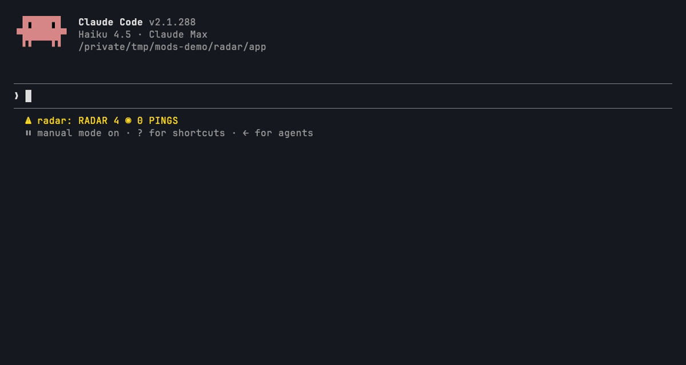

# radar

```
  ▄▄▀▀▀▀▀▄▄      █▀█ ▄▀█ █▀▄ ▄▀█ █▀█
 ▀▀▀▀▀▀▀▀▀▀▀     █▀▄ █▀█ █▄▀ █▀█ █▀▄
▀▀▀▀▀▀▀▀▀▀▀▀▀
▀▀▀▀▀▀▀▀▀▀▀▀▀    MEMORY AT THE MOMENT IT MATTERS
▀▀▀▀▀▀▀▀▀▀▀▀▀
 ▀▀▀▀▀▀▀▀▀▀▀
    ▀▀▀▀▀
```



**The problem:** a memory file helps only if the model thinks of it at the right moment, and usually it doesn't. The study behind this library found **at least 11 mistakes that recurred after they had been written down**. Meanwhile **~2.7k tokens of memory index** were loaded into every session, whether or not any of it applied.

radar indexes your memory files when the session starts. When a tool call touches what a memory is about, the call runs as normal, and radar attaches that memory's description and rule lines to the result. Only the model sees it, right next to the output of the command or edit that made it relevant. A lavender radar scope in the `/radar` pane pings each time. radar never edits a memory file.

## Install

```
/plugin marketplace add pourya7/claude-code-mods
/plugin install radar@claude-code-mods
```

## How it behaves

- **Sources.** radar reads every `*.md` file directly inside each memory folder (subfolders are not searched):
  - `userConfig.memoryDirs`, if you set it;
  - otherwise `autoMemoryDirectory` from your settings;
  - otherwise `~/.claude/projects/<project>/memory`, where `<project>` is the session's project root with every non-alphanumeric character turned into `-`. If `CLAUDE_CONFIG_DIR` is set, it replaces `~/.claude`.
- **A memory** is a file whose frontmatter has `name` and `description`. It can also have:
  - `triggers:`, a list of regexes. They are case-insensitive. Use single quotes so backslashes survive.
  - rule lines: any line in the body that contains **never**, **always**, **don't**, **do not** or **must**. radar keeps up to 5 of them, each cut to 240 characters.

  ```markdown
  ---
  name: Never checkout a dirty file
  description: copy it aside first; checkout -- throws away uncommitted work
  triggers:
    - 'git checkout --\s'
    - 'git restore\b'
  ---
  - Never run `git checkout -- <file>` on a file with changes.
  - Always copy it aside first and read it back.
  ```

- **Not a memory.** A file with no frontmatter at all, such as the `MEMORY.md` index, is skipped quietly. A file whose frontmatter is broken is skipped too, and every broken file is counted in one toast: an unclosed `---`, a missing `name` or `description`, a line that is not `key: value`, an unclosed quote or text after a closing quote, a trigger that is not a valid regex, or a trigger that nests a repeat inside a repeat (such as `(\S+\s*)+`), which can backtrack for minutes. `/radar` lists each skipped file and the reason.
- **Indexing.** radar reads the folders on `session.start` and again on `/radar reload` or the pane's `RELOAD` button. `session.start` also fires again on a hot reload of the plugin and when you change radar's settings in `/config`, so those re-read the folders too. Edits you make to memory files during a session take effect after a reload.
- **What a call is about:**
  - Bash: the command.
  - Edit, Write, Read, NotebookEdit, Glob and Grep: the path and the pattern.
  - WebFetch and WebSearch: the URL and the query.
  - MCP tools (`mcp__*`): the tool's name and every string in its arguments.
  - Any other tool: only its `file_path`, `notebook_path`, `path`, `url`, `query` and `pattern` arguments. Agent and Skill have none of these, so their prompts are never matched.
- **Matching** is deterministic. No model is called. For each call:
  1. **Triggers first.** A memory whose trigger regex matches the call's text is a match.
  2. **Then keywords.** radar splits the name and description into words. It drops stop-words, words shorter than 3 letters, numbers, and words that more than max(3, 10%) of your memories share. A memory matches when the call shares **at least 2** of its remaining words. Memories that share more words rank higher.
- **Attaching.** The call always runs first (`await next(e)`). Then up to **2** matching memories are attached as `context` that only the model reads:

  ```
  radar: your memory "Never checkout a dirty file" (/home/dev/.claude/projects/-work-app/memory/dirty.md) is about this call (trigger match).
  copy it aside first; checkout -- throws away uncommitted work
  Rules:
  - Never run `git checkout -- <file>` on a file with changes.
  - Always copy it aside first and read it back.
  ```

- **Calls on the memory files are left alone.** A call whose text names a path inside one of the indexed folders (absolute or `~/...`), such as reading or editing a memory file, or the engine writing its own memory, is not matched at all. Otherwise a memory's own file name would ping that memory.
- **Once per turn.** A memory is attached at most once per main-loop turn. Subagent calls are matched too, and they count toward the same turn. A call that another hook refuses gets nothing.
- **Pings.** Each attachment toasts `RADAR ▸ <memory name>`, unless `toast` is off. It also bumps the status line and adds a row to the pane. The pane keeps the last 20 pings.

## Commands

| Command | What it does |
|---|---|
| `/radar` | Opens the RADAR pane and replies with the same summary as text. |
| `/radar list` | The summary as text only: folders, memories, recent pings and skipped files. |
| `/radar reload` | Reads the memory folders again. |

## Configuration (`userConfig`)

| Field | Type | Default | Meaning |
|---|---|---|---|
| `memoryDirs` | string | `""` | Memory folders to index, separated by commas. `~` means your home folder. Leave it empty to use the auto-memory folder (see **Sources**). A configured folder that does not exist is reported once. |
| `toast` | boolean | `true` | Toast `RADAR ▸ <memory name>` on each ping. With it off, only the status line and the pane change. |

You can change these in the `/config` menu, or under `pluginConfigs.radar` in your settings.

## The UI

The `/radar` pane after two pings. The scope's beam turns one step with each ping, and the last three pings show as pink blips on the glass:

```
  ▄▄▀▀▀▀▀▄▄    RADAR · 274 MEMORIES
 ▀▀▀▀▀▀▀▀▀▀▀   2 PINGS THIS SESSION
▀▀▀▀▀▀▀▀▀▀▀▀▀  SCANNING
▀▀▀▀▀▀▀▀▀▀▀▀▀  ~/.claude/projects/-Users-dev-work-app/memory
▀▀▀▀▀▀▀▀▀▀▀▀▀
 ▀▀▀▀▀▀▀▀▀▀▀   [ RELOAD ]
    ▀▀▀▀▀
────────────────────────────────────────────────────────────
09:41  BASH  ● Docker stack capacity
09:05  BASH  ◆ Never checkout a dirty file
```

This capture is plain text. In the terminal the scope is a navy disc with a lavender rim, a dark grey crosshair and range ring, a light grey beam with a lavender trail, and pink blips. In the ping rows, `◆` marks a trigger match and `●` a keyword match. Every colour is from the PICO-8 palette.

The status line stays under 40 columns: `RADAR 274 ◉ 3 PINGS`. The `/radar` text reply carries the same summary as the pane, so in `claude -p`, which has no screen to draw on (the engine still counts the pane as placed), and on any surface that does not show panes, the text reply, the status line and the toasts are what you see.

## Permissions

| Network | Runs processes | Files | Calls a model | Auto-submits prompts | Data leaving the machine |
|---|---|---|---|---|---|
| None. No `$.http`. | None. No `$.process`. | **Reads only.** `$.fs.list` and `$.fs.read` read the `*.md` files in the memory folders. `$.settings.read` reads `autoMemoryDirectory`. `$.env.get` reads `HOME` and `CLAUDE_CONFIG_DIR`. Nothing is written: no `$.fs.write`, no `$.store`. The index and pings live only for the session, in `$.state`. | No. Matching is regex and keywords; there is no `$.model` call. | No. | Only the memory text radar attaches as `context`. It goes to your own model, as part of the tool result in the conversation. |

## Limits

- **After, not before.** The memory arrives with the call's result, so the model reads it after that call has run. It shapes the next step, but it cannot stop the call. To block a call, use a rule enforcer such as tripwire.
- **Keywords are a heuristic.** A memory whose words don't appear in the command, path or URL will be missed, and a memory that shares two common words can be attached when it doesn't apply. Add `triggers` to the memories that matter most. The df cut-off (max(3, 10%)) means that with fewer than about 30 memories, a word must appear in 3 or fewer of them to count.
- **The default folder** is worked out from the session's project root. In a linked git worktree that can differ from the folder the engine itself uses for memory. If radar shows 0 memories there, set `memoryDirs`.
- **Frontmatter** is a small subset of YAML: top-level `key: value` lines, quoted or plain values (a trailing `# comment` is dropped), block scalars (`description: >` or `|` followed by indented lines, which are joined), and `triggers` as a block list (`- '...'`), a flow list (`['a', 'b']`) or a single value. Nested keys, such as `metadata:`, are ignored. Anchors, aliases, tags and multi-line flow lists are not read.
- **Size.** radar reads at most 2,000 files across all folders and only reads top-level files. A file over 4 MiB cannot be read and is reported as skipped. Every call's text, Bash commands included, is cut to its first 4,000 characters before matching, so a trigger only sees that much. The nested-repeat check on triggers is a heuristic: keep trigger regexes simple.
- **Reload.** A hot reload or a change to radar's `/config` settings fires `session.start` again, so radar re-reads the folders and repeats the skipped-files toast if any are still broken. The pings and the ping count live in `$.state` and survive it.

## Development

```
claude plugin validate radar
claude plugin test radar
```

Pure logic lives in `hooks/memory.ts` (the frontmatter and rule-line parser), `hooks/match.ts` (tokens, the index and ranking) and `hooks/text.ts` (folders, the context note and the status line). The scope sprite is in `hooks/pixels.ts`. `hooks/register.tsx` connects them to the engine. The tests feed an in-memory folder of memory files and mount the pane on both `terminal` and `desktop`.
