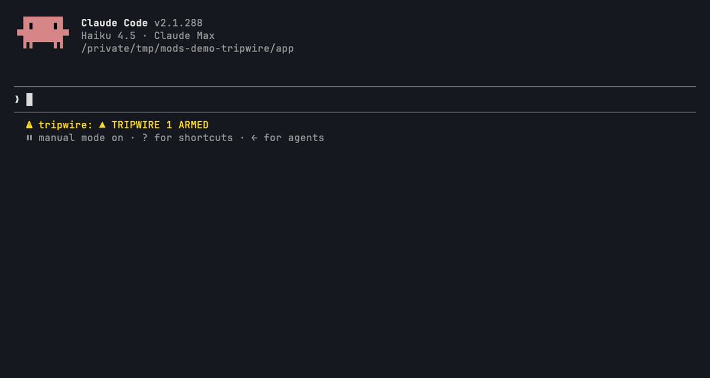

# tripwire

```
      ▄▀▀▄      ▀█▀ █▀█ █ █▀█ █ █ █ █ █▀█ █▀▀
   ▄▀▀▀▀▄▄       █  █▀▄ █ █▀▀ ▀▄▀▄▀ █ █▀▄ ██▄
  ▀▀▀▀▀▀▀▀▀
▄▄▄▀▀▀▀▀▀▀▄▄    RULES THAT ARE ENFORCED, NOT REMEMBERED
```



**Memories are advice, mods are law.** A rule you wrote in `CLAUDE.md` or memory is something the model may forget. Tripwire checks it at the moment of the tool call, every call, subagents included.

**The problem, in one line:** across 189 memory files there were 405 "never / don't" lines, and at least 11 mistakes were repeated *after* they had been written down.

## Install

```
/plugin marketplace add pourya7/claude-code-mods
/plugin install tripwire@claude-code-mods
```

Then give it some rules. `/tripwire init` writes the starter pack to `~/.claude/tripwire.json` (only if that file does not exist yet), or copy [`examples/tripwire.json`](examples/tripwire.json) yourself.

## Rules

Rules live in two files, read in this order:

1. `~/.claude/tripwire.json`: yours, for every project
2. `<project>/.claude/tripwire.json`: the project's, shared with the repo. It may hold `deny`, `ask` and `note` rules only: a `rewrite` rule there is reported as a bad rule and skipped, so a repository you clone can never change the commands you run. Put rewrite rules in your own file.

They load when the session starts and again on `/tripwire reload`. A file is either an array of rules or `{ "rules": [...] }`.

```json
{
  "id": "no-force-push",
  "tool": "Bash",
  "match": "\\bgit(?:\\s+(?:-[Cc]\\s+\\S+|-{1,2}\\w[\\w-]*(?:=\\S+)?))*\\s+push\\b[^;&|\\n]*\\s(?:(?:--force|-f)(?=\\s|$)|\\+[^\\s:+])",
  "field": "command",
  "action": "deny",
  "message": "Force pushes rewrite shared history. Use --force-with-lease.",
  "cite": "memory/never-force-push.md"
}
```

| Key | Meaning |
|---|---|
| `id` | A unique name. A repeated id is skipped and reported. |
| `tool` | A tool name (`Bash`, `Edit`, `WebFetch`, ...), a glob (`mcp__*`, `mcp__*__merge`), or `*` for every tool. |
| `match` | A JavaScript regular expression tested against the field. |
| `field` | Which input field to test (`command` for Bash, `file_path` for Edit/Write/Read, `url` for WebFetch). Left out, the whole tool input as JSON. |
| `action` | `deny`, `ask`, `rewrite` or `note` (below). |
| `message` | What the model reads when the rule fires. |
| `cite` | Optional: where the rule was written down. Shown with the message. |
| `replace` | `rewrite` only: the replacement text (`$1` works). Every match in the field is replaced. A `rewrite` needs a `field`. |

Matching rules apply in file order, on every tool call, in the main session and in every subagent.

| Action | What happens |
|---|---|
| `deny` | The call is refused. The model gets a `TRAP SPRUNG!` error with the id, message and cite, and a red band appears above your prompt. Later rules are not checked. |
| `ask` | The call goes to a permission prompt (through `tool.check`), with the rule's message as the reason. It never turns a deny from your settings into an ask. |
| `rewrite` | The field is rewritten before the call runs. Later rules see the rewritten input. It is never silent: the model reads `tripwire rewrite [id]: <message> (command was: ... → now: ...)` after the result (or after the error, if the rewritten call is refused), and you get a `TRIPWIRE REWROTE BASH: <id>` toast. User file only. |
| `note` | The call runs, and the message is attached after the result as context only the model reads. |

A rule with a bad regex, an unknown action or a missing key is **skipped, never fatal**: you get one toast per load (`TRIPWIRE: 2 BAD RULES SKIPPED · /tripwire`), and the pane lists each problem.

### Starter pack

[`examples/tripwire.json`](examples/tripwire.json) holds eight generic rules:

| id | action | catches |
|---|---|---|
| `no-force-push` | deny | `git push --force` / `-f` and `+refspec` pushes such as `git push origin +main`, also behind global options (`git -C dir push ...`). A `--force-with-lease` push passes. |
| `no-verify` | deny | `--no-verify` on commit, push, merge, rebase, am, cherry-pick, also behind global options (`git -c k=v commit ...`) |
| `no-admin-merge` | deny | `gh pr merge --admin` |
| `no-checkout-discard` | deny | `git checkout -- <file>`, with a hint to back the file up first |
| `no-rm-root` | deny | `rm` of `/`, `/*`, `~`, `~/` or `$HOME` |
| `no-curl-pipe-sh` | deny | `curl ... \| sh` and `wget ... \| bash` |
| `checks-after-push` | note | `gh pr checks`: a reminder that checks right after a push may belong to the previous commit |
| `protected-host` | ask | a template: anything mentioning `api.example.com`. Change the host or delete it. |

## Commands

| Command | What it does |
|---|---|
| `/tripwire` | Opens the `TRAPS ARMED: N` pane. Each rule shows its id, action, hit count and last hit, with a **DISARM** button that turns it off for this session (**REARM** turns it back on). |
| `/tripwire list` | The same list as text (for `claude -p` and surfaces without panes). |
| `/tripwire reload` | Re-reads both rule files. |
| `/tripwire add <sentence>` | Asks a model to turn a plain-English rule into rule JSON and shows it in the pane with **ARM** and **DISCARD**. Only ARM writes anything: it appends the rule to `~/.claude/tripwire.json` and reloads. If the model's reply is not a valid rule, the pane shows why and offers nothing to arm. |
| `/tripwire init` | Writes the starter pack to `~/.claude/tripwire.json` if the file does not exist. It never overwrites. |

Hit counts are kept per rule id across sessions in the plugin's own store. Each hit is added to the count stored at that moment, so two sessions running at once add up rather than overwrite each other.

## Options

Set them in `/config` or under `pluginConfigs.tripwire.options` in settings.

| Option | Default | Meaning |
|---|---|---|
| `compileModel` | `haiku` | The model `/tripwire add` asks for a proposal. |
| `band` | `true` | Show the red `TRAP SPRUNG!` band above the prompt when a deny fires. Off, a deny shows a toast instead. |

## What it looks like

In the terminal the sprites are drawn in PICO-8 colours: a red bomb with a lit orange-and-yellow fuse on a grey wire. This text capture loses the colours.

The band after a deny:

```
      ▄▀▀▄    TRAP SPRUNG!  NO-FORCE-PUSH · BASH BLOCKED
   ▄▀▀▀▀▄▄    Force pushes rewrite shared history. Use --force-with-lease.
  ▀▀▀▀▀▀▀▀▀   CITE memory/never-force-push.md
▄▄▄▀▀▀▀▀▀▀▄▄  [ OK ]
```

The `/tripwire` pane:

```
 ▄▀▀▄  TRAPS ARMED: 7
▄▀▀▀▀▄ 8 USER · 0 PROJECT · 1 DISARMED
────────────────────────────────────────────────────────────
● NO-FORCE-PUSH         DENY      x3 14:02 [ DISARM ]
● NO-VERIFY             DENY      x0 --:-- [ DISARM ]
● NO-ADMIN-MERGE        DENY      x0 --:-- [ DISARM ]
● NO-CHECKOUT-DISCARD   DENY      x1 09:47 [ DISARM ]
● NO-RM-ROOT            DENY      x0 --:-- [ DISARM ]
● NO-CURL-PIPE-SH       DENY      x0 --:-- [ DISARM ]
● CHECKS-AFTER-PUSH     NOTE     x12 14:05 [ DISARM ]
○ PROTECTED-HOST        OFF       x0 --:-- [ REARM ]

PROPOSED RULE · NOT ARMED
"never deploy on a friday"
{
  "id": "no-friday-deploy",
  "tool": "Bash",
  "match": "\\bdeploy\\b",
  "field": "command",
  "action": "ask",
  "message": "Confirm a deploy."
}
[ ARM ] [ DISCARD ]
```

What the model reads when a deny fires:

```
▛▀▀▀▀▀▀▀▀▀▀▀▀▀▀▜
▌ TRAP SPRUNG! ▐  [no-force-push]
▙▄▄▄▄▄▄▄▄▄▄▄▄▄▄▟
Force pushes rewrite shared history. Use --force-with-lease.
CITE memory/never-force-push.md
This call was blocked by a tripwire rule. Do not retry it in another form; take another approach or ask the user.
```

The status line reads `▲ TRIPWIRE 7 ARMED`, plus `· 2 BAD` when some rules were skipped.

## Permissions

| Network | Runs processes | Files | Calls a model | Auto-submits prompts | Data leaving the machine |
|---|---|---|---|---|---|
| None of its own. The one model call goes through Claude Code's own client. | No | Reads `~/.claude/tripwire.json` and `<project>/.claude/tripwire.json` (and the `HOME` variable to find the first). The project file is loaded from any repo you open, without a prompt; it may deny, ask or note but never rewrite (see Limits). Writes `~/.claude/tripwire.json` only when you press **ARM** or run `/tripwire init` (only if the file is missing). Keeps hit counts in its plugin store. | Only on `/tripwire add`: one completion with `compileModel` (default `haiku`). | No | Only on `/tripwire add`: your sentence, the rule schema and three fixed examples go to your configured Claude model. Nothing else is sent. |

## Limits

- A project rule file is loaded from whatever repository the session opens, with no prompt. It cannot rewrite, but its `note` rules add text the model reads and its `deny`/`ask` rules can block or interrupt calls. Review a repo's `.claude/tripwire.json` like code; `/tripwire list` shows which rules came from the project.
- `ask` relies on the permission prompt. In a mode that answers every prompt for you (for example bypass permissions), the mode decides.
- A regex on a shell command is best effort: a determined model can spell a command another way. Each deny tells it not to retry the blocked call in another form, but a deny is a guardrail, not a sandbox.
- `checks-after-push` cannot know when you last pushed, so it reminds on every `gh pr checks`.
